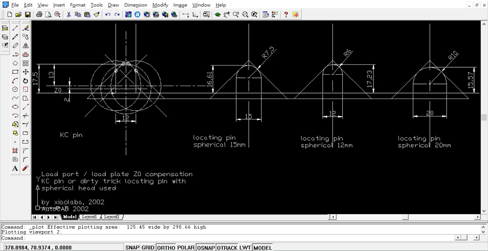

# SEMI_E57_KC_pin_model_and_locating_pin_dirty_trick_compensation
3D 2D AUTOCAD file, attempts to build KC pin drawing and LISP programming.  
this is very old archived file or design prior to year 2002.

### 2D file for easy calculation and compensation with different pin head/diameter  
DWG file, [KC_pin_compensation.dwg](KC_pin_compensation.dwg)  
view and plot  
PDF, [KC_pin_compensation.pdf](KC_pin_compensation.pdf)  
screen shot,   


### 3D file, not available, uses LISP to build on the fly
LISP file, [KCPin.lsp](KCPin.lsp)   
Note, no 100% match to the real design, just demo to build 3D model  
```
(defun c:SEMI_KCPin ( / oldCmd p0 rSphere hPin rFlange hFlange rHole ptBase ptFlange ptSphere ptCutter eSphere eFlange eHole eCutter)

  ;; ACAD 2002 teminal, type "VLISP", open lisp editior, copy and paste this code, press ENTER
  ;; tpye SEMI_KCPin, press ENTER
  ;; default press ENTER, and then type "Both", press ENTER
  ;; type "RR" press ENTER, will see 3D model
  ;; this code was not tested completely to build KC pin or the design, just experimental

  (setq oldCmd (getvar "CMDECHO"))
  (setvar "CMDECHO" 0)
  (command "_.undo" "_begin")

  ;; Base point selection
  (setq p0 (getpoint "\nSelect Kinematic Pin center base point <0,0,0>: "))
  (if (null p0) (setq p0 '(0.0 0.0 0.0)))

  ;; SEMI E57 Standard Dimensions (mm)
  (setq rSphere  15.0)   ; Spherical contact tip radius
  (setq hPin     13.0)   ; Height of main pin body above flange
  (setq rFlange  12.0)   ; Base mounting flange radius (32mm outer dia)
  (setq hFlange   2.0)   ; Base flange thickness
  (setq rHole     4.5)   ; Center mounting screw clearance hole (M8 bolt)

  (setq ptBase   p0)
  (setq ptFlange (list (car p0) (cadr p0) (+ (caddr p0) hFlange)))
  (setq ptSphere (list (car p0) (cadr p0) (+ (caddr p0) hFlange hPin (- rSphere))))

  ;; 1. Draw Base Flange
  (command "_.CYLINDER" ptBase rFlange hFlange)
  (setq eFlange (entlast))

  ;; 2. Draw Main Spherical Contact Head
  (command "_.SPHERE" ptSphere rSphere)
  (setq eSphere (entlast))

  ;; 3. Fuse Flange and Spherical Head into single Solid
  (command "_.UNION" eFlange eSphere "")

  ;; 4. Cut 45-degree Lead-in Chamfer on top side
  (setq ptCutter (list (+ (car p0) rSphere 2.0) (cadr p0) (+ (caddr p0) hFlange hPin)))
  (command "_.CYLINDER" ptFlange (+ rSphere 2.0) hPin)
  (setq eCutter (entlast))
  ;; Slice top edge at 45 deg to create FOUP lead-in slope
  (command "_.SLICE" (entlast) "" "3P" 
           (list (car p0) (- (cadr p0) rSphere) (+ (caddr p0) hFlange hPin -3.0))
           (list (car p0) (+ (cadr p0) rSphere) (+ (caddr p0) hFlange hPin -3.0))
           (list (+ (car p0) rSphere) (cadr p0) (+ (caddr p0) hFlange hPin))
           ptBase)

  ;; 5. Subtract M8 Center Mounting Hole
  (command "_.CYLINDER" (list (car p0) (cadr p0) (- (caddr p0) 2.0)) rHole (+ hFlange hPin 5.0))
  (setq eHole (entlast))
  (command "_.SUBTRACT" (entlast) "" eHole "")

  (command "_.undo" "_end")
  (setvar "CMDECHO" oldCmd)
  (princ "\nSEMI E57 Kinematic Coupling Pin (Solid) created successfully.")
  (princ)
)

(princ "\nType 'SEMI_KCPin' in AutoCAD 2002 to generate the 3D pin.")
(princ)
```
